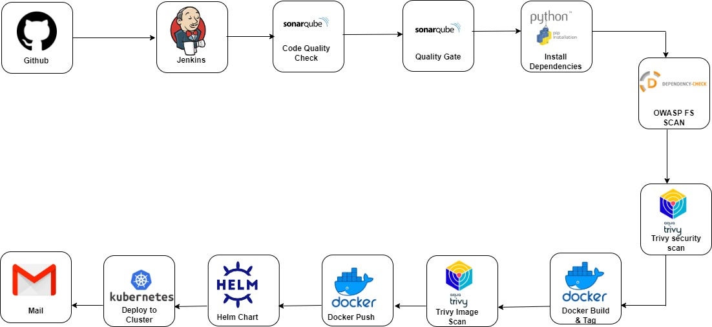

# DevSecOps: CI/CD pipeline to deploy a Python Flask REST API on a Kubernetes Cluster
- The app generates random programming quotes.

#### CI/CD   `Jenkins`
#### Tools      `Python pip, Aqua trivy, Sonarqube, OWASP scan, Docker, Helm, Kubernetes`
#### Cloud Platform  : ` AWS `

- I **Dockerized** the application, created a **Helm Chart**, CI/CD pipeline using **Jenkins** and also the **Kubernetes cluster** where the application will be deployed.

